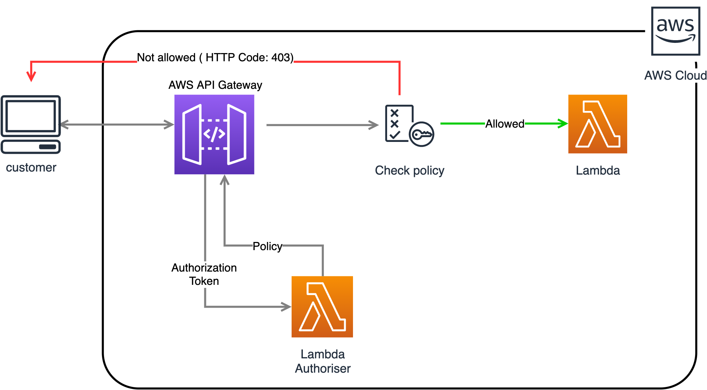

# Lambda Authoriser Pattern (Terraform)

AWS API Gateway allows you to implement your custom authoriser.

#### **Why do you need a custom authoriser?**

A Lambda authorizer is useful if you want to implement a custom authorization that uses request parameters to determine the caller's identity.

#### **How it works?**

The customer calls our API with a token header. When the API Gateway gets the request it calls to the Lambda Authoriser. Inside this lambda you make your own custom logic to check if the customer is authorised or not. 




####  **Terraform Implementation API Gateway Lambda authorizers**

Terraform code that implements the model described in this doc.

#### 👨‍💻 **Project structure**

- */authoriser-lambda*: Folder that contains the code of the lambda that authorise the request.

- */example-lambda*: Folder that contains an example of a lambda that recieves an authorised request.

- */mapping-template*: Folder that contains the mapping template that takes from the context the authoizer and inject it into the Authorization header.

#### 🔧 **Requirements**

| Name | Version |
|------|---------|
| terraform | >= 0.12 |

#### 🔧 **Providers**

| Name | Version |
|------|---------|
| archive | n/a |
| aws | n/a |
| null | n/a |

#### 📝 **Inputs**

| Name | Description | Type | Default | Required |
|------|-------------|------|---------|:--------:|
| aws\_region | The AWS region to create things in. | `string` | `"eu-west-2"` | no |

<br>
You can get your account id by running from your terminal:

`aws sts get-caller-identity`


#### 📃 **Outputs**

| Name | Description |
|------|-------------|
| api\_endpoint\_url | # API URL |

<br>

#### 🚀 **Deploy the app**

Execute
```
terraform plan
```
Review the plan to understand the objects that will be created as part of this deployment and if you are happy with it run
```
terraform apply
```

#### ✅ **Test the authoriser**

Execute the following curl replacing the `https://endpoint.execute-api.eu-west-2.amazonaws.com/` url with the value that you got as part of the output of your terraform apply.

```
curl --location --request GET 'https://endpoint.execute-api.eu-west-2.amazonaws.com/' \
--header 'Authorization: allow'
```

Note the header `Authorization: allow`; now try to make the same curl but put `deny` instead of `allow` as Authorisation.